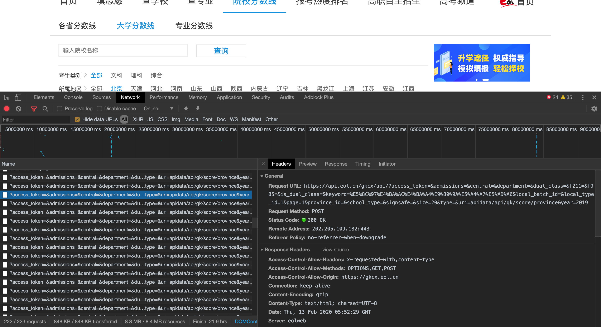
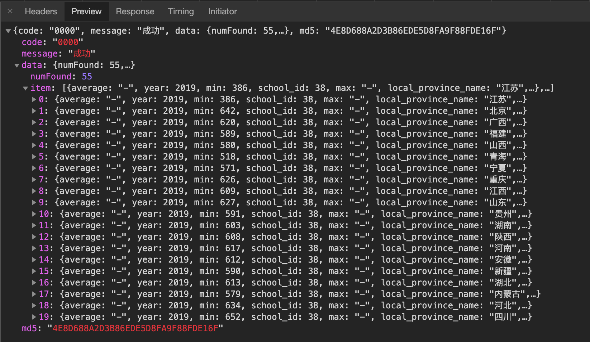

# 爬虫 for JS
爬取的网站：**https://gkcx.eol.cn/lineschool**  获取大学的录取分数线  
由于网站采用了JS的动态加载，因此无法直接通过查看网页源代码获得。因此这里，我们首先用chrome的开发者模式分析JS提交的表单Header。

可以看到获取的方法为"POST",其中请求的内容为：
```
https://api.eol.cn/gkcx/api/?access_token=&admissions=&central=&department=&dual_class=&f211=&f985=&is_dual_class=&keyword=%E5%8C%97%E4%BA%AC%E4%BA%A4%E9%80%9A%E5%A4%A7%E5%AD%A6&local_batch_id=&local_type_id=1&page=1&province_id=&school_type=&signsafe=&size=20&type=&uri=apidata/api/gk/score/province&year=2019
```
这样就可以发现真正请求的原地址为：**https://api.eol.cn/gkcx/api/** 而后面的内容就是需要填写的表单。
另外查看Preview就可以获取服务器返回的内容，也就是我们真正需要的数据。

那么整个分析的过程就是这样了。

